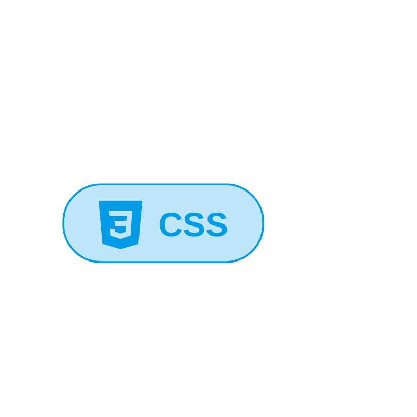
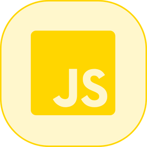
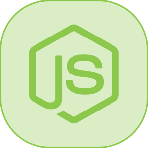
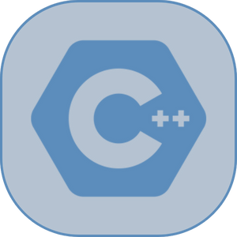

&nbsp;&nbsp;&nbsp;&nbsp;&nbsp;&nbsp;&nbsp;&nbsp;&nbsp;&nbsp;&nbsp;&nbsp;&nbsp;&nbsp;&nbsp;&nbsp;&nbsp;&nbsp;&nbsp;&nbsp;&nbsp;&nbsp;&nbsp;&nbsp;
## Bem-vindo ao meu mundo!

Olá! Luccas aqui, apaixonado por tecnologia, amante de café e entusiasta da criatividade.

- 💻 Desenvolvedor de software em constante aprendizado.
- 📚 Compartilho meu conhecimento através de artigos e tutoriais.
- 🎨 Adoro design e estou sempre procurando novas inspirações.
- ☕ Viciado em café e em boas conversas.

Fique à vontade para explorar meus projetos e entre em contato se quiser trocar ideias ou colaborar em algo novo!
